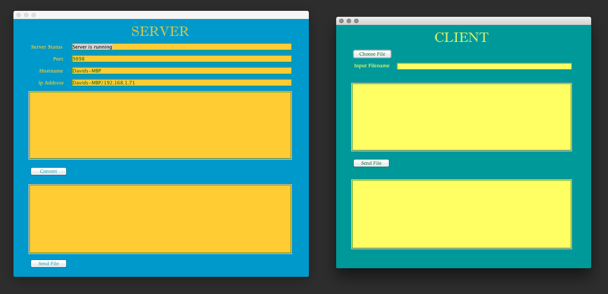
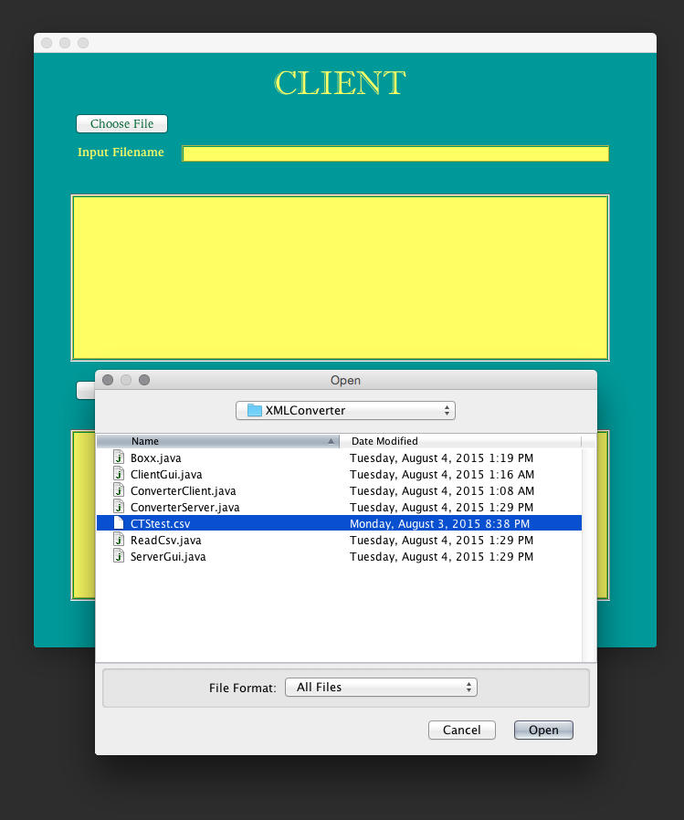
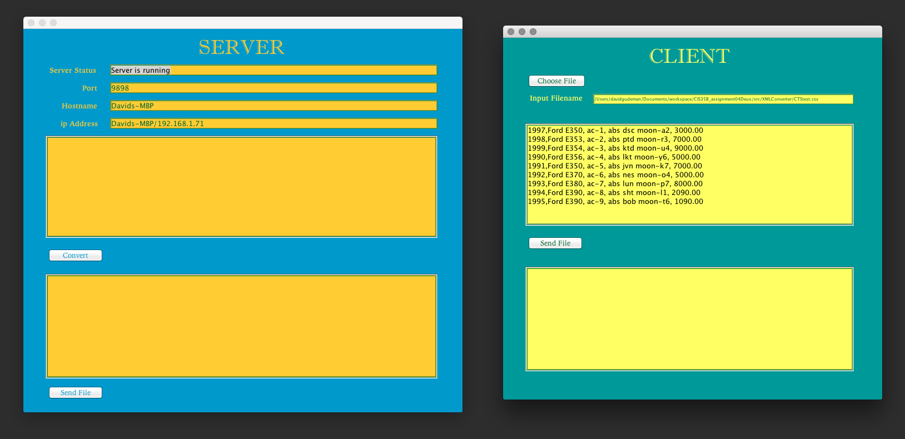
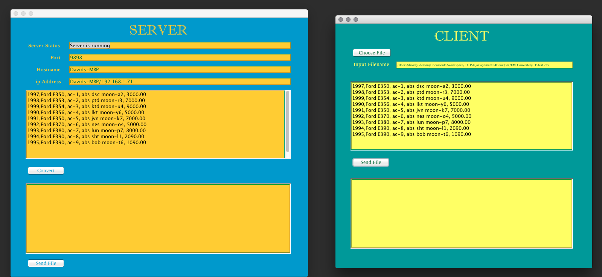
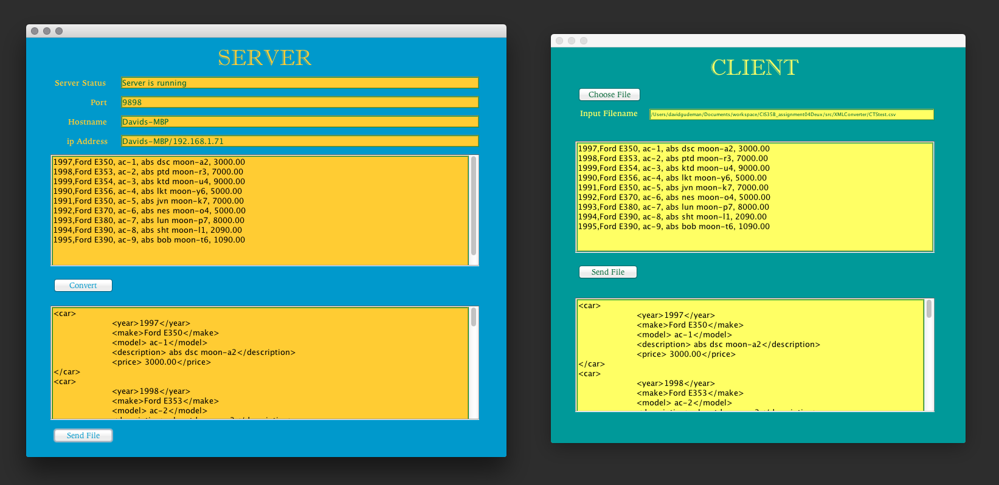

# CIS35B_assignment04v2
##Project:
A server/client dyad. The client chooses a comma delimited file, sends it
to the server.  The server converts it to XML and sends it back. The program
uses ports, GUI and multiple threads.

1. start

2. choose file

3. file chosen

4. sent to server

5. server converts

6. sends it back

